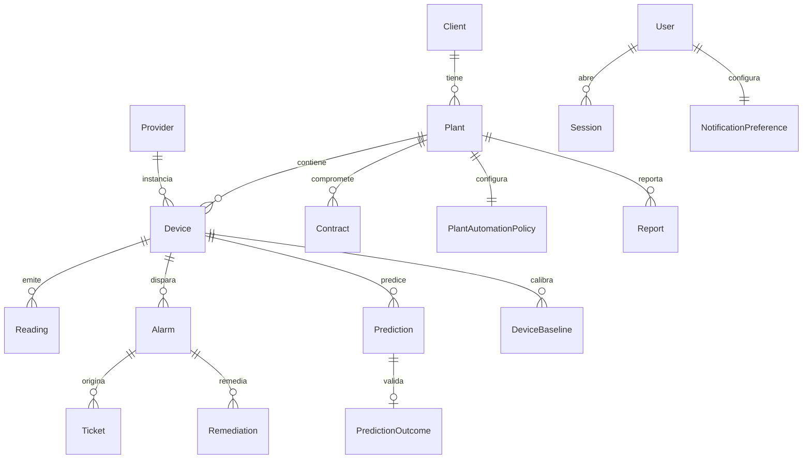
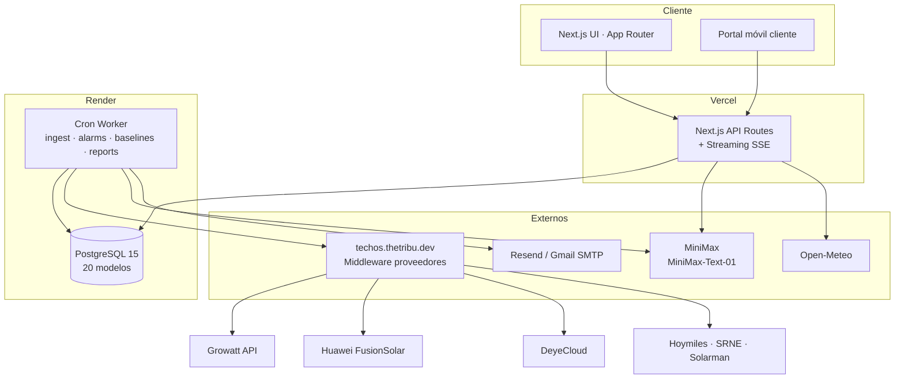

# SunHub · Documento de entrega · Techos Rentables

> Transferencia de conocimiento del MVP construido por **Equipo Los Incapaces** durante el **Hackathon TINKU 2026**. Este documento consolida lo necesario para que el equipo de Techos Rentables (o un proveedor de mantenimiento) pueda **levantar, operar, evolucionar y desplegar** la plataforma.
>
> **Versión:** 1.0 · **Fecha:** 2026-04-28
> **Repositorio:** `tinku_team_los_incapaces` · rama `main`
> **Contacto técnico:** Robert Triana, Duban Monsalve, John Nieto

---

## Tabla de contenido

1. [Resumen ejecutivo](#1-resumen-ejecutivo)
2. [Configuración y entorno](#2-configuración-y-entorno)
3. [Base de datos](#3-base-de-datos)
4. [Inteligencia Artificial](#4-inteligencia-artificial)
5. [Middleware y APIs externas (modelo recomendado)](#5-middleware-y-apis-externas-modelo-recomendado)
6. [Instalación y despliegue](#6-instalación-y-despliegue)
7. [Repositorio y documentación](#7-repositorio-y-documentación)
8. [Limitaciones conocidas y próximos pasos](#8-limitaciones-conocidas-y-próximos-pasos)
9. [Checklist de verificación de la entrega](#9-checklist-de-verificación-de-la-entrega)

---

## 1. Resumen ejecutivo

**SunHub** es un sistema operativo unificado que consolida en una sola superficie las 6 plataformas de monitoreo solar que opera Techos Rentables (Growatt, Huawei, DeyeCloud, Hoymiles, SRNE, Solarman). Sobre un modelo de datos canónico ofrece:

- **Dashboard unificado** de 200+ plantas multi-marca.
- **Detección de fallas en <5 min** con un motor de reglas sobre lecturas normalizadas.
- **Predicción 2–7 días** antes vía IA (MiniMax).
- **Reportes mensuales automáticos** (40 min manuales → 30 seg).
- **Recomendación de proveedor** óptimo por costo/beneficio histórico.
- **Inteligencia climática** con impacto operativo estimado.
- **Portal cliente** móvil.

**Stack:** Next.js 15 · React 19 · TypeScript · Tailwind · PostgreSQL 15 · Prisma · MiniMax · Open-Meteo · Vercel + Render.

---

## 2. Configuración y entorno

### 2.1 Runtime y herramientas

| Herramienta | Versión exacta | Notas |
|---|---|---|
| **Node.js** | **20.x LTS** (probado en 20.18) | Requerido por Next 15 + Prisma 5 |
| **npm** | **10.x** (viene con Node 20) | También funciona con `pnpm@9` o `bun@1.1`, pero **CI usa npm** |
| **Docker** | **24+** | Solo para Postgres y Mailpit en local |
| **Make** | GNU Make 3.81+ (preinstalado en macOS) | Wrapper de comandos (opcional) |
| **TypeScript** | 5.7 | Config: `tsconfig.json` (strict mode) |
| **Prisma** | 5.22 | ORM y migraciones |
| **Playwright** | 1.59 (Chromium) | Solo para el scraper Deye demo |

> Recomendación: usar **`nvm`** o **`fnm`** para fijar la versión local: `nvm use 20`.

### 2.2 Estructura de archivos `.env`

| Archivo | Versionado | Propósito |
|---|---|---|
| `.env.example` | ✅ sí | **Plantilla** con todas las variables y comentarios. Punto de verdad. |
| `.env.production.example` | ✅ sí | Plantilla para Vercel/Neon (producción). |
| `.env.local` | ❌ no (`.gitignore`) | Variables reales para desarrollo. **Crear copiando `.env.example`.** |
| `.env` | ❌ no | Fallback solo si no existe `.env.local`. |

### 2.3 Separación de entornos

| Entorno | DB | Middleware | LLM | SMTP | Despliegue |
|---|---|---|---|---|---|
| **dev** (local) | Postgres en Docker (`localhost:5432`) | `techos.thetribu.dev` con `tk_*` de pruebas | MiniMax (key dev) | Mailpit (`localhost:1025` + UI 8025) | `make up` |
| **staging** (Vercel preview) | Neon/Render branch DB | igual a prod (mismo MW) | MiniMax (key prod) o stub | Resend / Mailtrap sandbox | Auto en cada PR |
| **prod** | Postgres managed (Render Starter o Neon) | `techos.thetribu.dev` con key oficial | MiniMax key prod | Resend / Gmail SMTP | Vercel `main` + Render worker |

**Regla:** ninguna variable secreta vive en el repo. Todo secreto se inyecta por el dashboard de Vercel/Render o por un gestor (1Password, Vault).

### 2.4 Catálogo de variables de entorno

Documentadas en `.env.example`. Resumen crítico:

| Variable | Propósito | Ejemplo | Crítica |
|---|---|---|---|
| `MIDDLEWARE_BASE_URL` | URL del middleware Tinku | `https://techos.thetribu.dev` | ✅ |
| `MIDDLEWARE_API_KEY` | API key del equipo (Authorization header) | `tk_xxxxxxxxxxxxxxxx` | ✅ secret |
| `MINIMAX_API_KEY` | LLM Copilot + reportes + predicciones | `sk-api-xxxxxxxx` | ✅ secret |
| `MINIMAX_BASE_URL` | OpenAI-compatible endpoint | `https://api.minimax.io/v1` | ✅ |
| `MINIMAX_MODEL` | Modelo por defecto | `MiniMax-Text-01` | ✅ |
| `WEATHER_BASE_URL` | Open-Meteo (sin key) | `https://api.open-meteo.com/v1` | ✅ |
| `DATABASE_URL` | Postgres pooled (runtime) | `postgresql://…?pgbouncer=true` | ✅ secret |
| `DIRECT_URL` | Postgres directo (Prisma migrate) | `postgresql://…` | ✅ secret |
| `SMTP_HOST` / `SMTP_PORT` / `SMTP_USER` / `SMTP_PASSWORD` / `SMTP_FROM` | Notificaciones por email | ver `.env.example` | ⚠️ vacío = canal off |
| `APP_BASE_URL` | URL pública (links en correos) | `https://sunhub.vercel.app` | ✅ |
| `CRON_*` | Crons del worker (formato cron) | `*/5 * * * *` | ✅ |
| `ALARMS_WINDOW_DAYS` | Ventana hacia atrás (alarmas) | `2` | – |
| `NEXT_PUBLIC_DEYE_DEMO_TICK_MS` / `_SIM_STEP_S` | Tunables landing demo | `4000` / `30` | – (solo demo) |
| `SCRAPE_INTERVAL_MS` / `SCRAPE_BASE_URL` | Scraper Deye (Playwright) | `60000` | – (solo demo) |

> **Acción de entrega:** cargar todos los secretos críticos al gestor de Techos Rentables y reemplazar las keys del hackathon por keys productivas (MiniMax y MW).

### 2.5 Docker / docker-compose

El proyecto **no usa `docker-compose.yml`**. En su lugar, el `Makefile` levanta los contenedores auxiliares con `docker run`:

- `make db-up` → contenedor `sunhub-pg` (Postgres 15).
- `make smtp-up` → contenedor `sunhub-mail` (Mailpit).

Si se desea un compose oficial para staging on-prem, se puede agregar uno en `infra/docker-compose.yml` con servicios `db` y `mail`. **No es bloqueante** para producción porque la BD usa servicio managed (Render/Neon).

---

## 3. Base de datos

### 3.1 Motor

**PostgreSQL 15** (cualquier 14+ funciona). En producción se usa el servicio managed de Render (`postgresMajorVersion: "15"` en `render.yaml`). Alternativas válidas: **Neon**, **Supabase**, **AWS RDS**, **GCP Cloud SQL**.

**Conexión recomendada:** doble URL (pooled + direct) en variables `DATABASE_URL` y `DIRECT_URL` para que Prisma migrate use conexión directa y el runtime serverless use el pooler.

### 3.2 Migraciones

- **ORM:** Prisma 5.22.
- **Schema fuente:** `prisma/schema.prisma` (≈600 líneas, 20 modelos).
- **Comandos:**
  - `npm run db:push` → aplica schema en local sin migrar (modo hackathon).
  - `npm run db:migrate` → genera y aplica migración versionada (recomendado en prod).
  - `npx prisma migrate deploy` → solo aplica migraciones existentes (CI/CD).

> ⚠️ **Importante para prod**: el repo se entrega con **schema-only sync** (`db:push`). Antes del primer deploy productivo, generar la migración inicial: `npx prisma migrate dev --name init` y subir `prisma/migrations/` al repo. A partir de ahí, **`migrate deploy`** queda como build step (ya está en `render.yaml` y `vercel.json`).

### 3.3 Modelo de datos canónico

20 modelos agrupados en 7 dominios:

| Dominio | Modelos | Propósito |
|---|---|---|
| Auth | `User`, `Session` | Login email/password con cookies |
| Comercial | `Client`, `Plant`, `Contract`, `ReportSchedule` | Cliente → planta → contrato |
| Integración | `Provider`, `Device` | Proveedor (deye, growatt…) → dispositivos físicos |
| Series temporales | `Reading`, `DeviceBaseline` | Lecturas normalizadas + baselines (z-score) |
| Operación | `Alarm`, `Ticket`, `NotificationLog`, `NotificationPreference` | Detección + acción humana |
| IA | `Prediction`, `PredictionOutcome` | Predicciones + outcome para RAG |
| Automatización | `PlantAutomationPolicy`, `Remediation`, `RemediationAudit` | Comandos remotos auditables |
| Reportes | `Report`, `ReportSchedule` | Mensuales por planta/cliente |

**Modelo central:** `Reading` (series por dispositivo). Indexada por `(deviceId, ts DESC)`. Para volumen >10M filas se recomienda particionado por mes (post-MVP).

### 3.4 Diagrama ERD

El ERD completo se puede regenerar con:

```bash
npx prisma generate
npx prisma-erd-generator   # opcional, requiere @prisma/erd-generator
```

Diagrama Mermaid simplificado de los modelos clave:



### 3.5 Restaurar la BD desde cero (local)

```bash
# 1) Levantar Postgres en Docker
make db-up

# 2) Aplicar schema
make db-push

# 3) Crear usuario admin inicial
make create-user EMAIL=admin@sunhub.co PASSWORD=admin123 ROLE=admin NAME=Admin

# 4) Sincronizar plantas reales desde el middleware (opcional)
make plants-sync

# 5) Sembrar planta demo TR-001 (opcional, sin depender del MW)
make seed-robert
```

**Reset destructivo (preserva usuarios):** `make data-reset YES=1`.

### 3.6 Dumps y seed

- **Seed sintético:** `scripts/seed-robert-plant.ts` → planta `TR-001` con 30 días de lecturas, baselines, predicciones y alarmas. Idempotente. Útil para demo sin dependencias externas.
- **Sync real:** `scripts/sync-real-plants.ts` consulta el middleware y crea registros en `Plant` + `Device`.
- **Dump productivo:** se recomienda configurar **backups diarios** del servicio managed (Render lo hace automático en plan Starter+; Neon en plan Pro). Para dumps manuales: `pg_dump $DATABASE_URL > backup.sql`.

---

## 4. Inteligencia Artificial

### 4.1 Modelos usados

| Caso de uso | Modelo | Proveedor | Endpoint | Notas |
|---|---|---|---|---|
| **Copilot** (chat operativo) | `MiniMax-Text-01` | **MiniMax** (patrocinador hackathon) | `POST /v1/text/chatcompletion_v2` | OpenAI-compatible. Streaming SSE. |
| **Generación de reportes** mensuales | `MiniMax-Text-01` | MiniMax | mismo endpoint, modo JSON | `chatJSON()` → respuesta estructurada |
| **Predicciones 2–7 días** | `MiniMax-Text-01` | MiniMax | mismo endpoint | RAG con outcomes previos |
| **Sugerencia de remediación** en alarmas | `MiniMax-Text-01` | MiniMax | mismo endpoint | `aiSuggestion` en `Alarm` |

> **Recomendación de migración:** MiniMax es el patrocinador del hackathon. Para producción, Techos Rentables puede mantener MiniMax o migrar a **OpenAI (GPT-4o / GPT-4o-mini)**, **Anthropic (Claude Sonnet 4.6 / Haiku 4.5)** o **Gemini 2.5**. La capa `src/lib/minimax.ts` está aislada — basta con sustituir el cliente y mantener la firma `chat() / chatStream() / chatJSON()`. El esfuerzo estimado es **<1 día**.

### 4.2 Prompts del sistema

Los prompts viven **en código**, separados por caso de uso, en archivos dedicados de `src/lib/`:

- `src/lib/use-streaming-chat.ts` → prompt del Copilot (chat operativo).
- `src/lib/predictions.ts` → prompt de predicción (entrada: features de baselines).
- `src/lib/reports.ts` → prompt de generación de reporte mensual (entrada: KPIs + alarmas del mes).
- `src/lib/remediation.ts` → prompt de sugerencia de remediación (entrada: alarma + contexto).
- `src/lib/rules.ts` → prompt opcional de enriquecimiento de reglas.

> **Recomendación:** mover los prompts a archivos `src/lib/prompts/<caso>.md` o a una tabla `prompts` versionada en BD para que ops pueda iterarlos sin redeploy. **No es bloqueante** para entrega.

### 4.3 Claves API y cuotas

| API | Variable | Cuota MiniMax (referencia hackathon) | Quien la consigue |
|---|---|---|---|
| MiniMax | `MINIMAX_API_KEY` | ~1M tokens/día (hackathon); cuota oficial depende del plan contratado | Techos Rentables debe contratar plan productivo en `https://platform.minimax.io` |
| Middleware Tinku | `MIDDLEWARE_API_KEY` | rate-limit 429 por endpoint provider; ver `docs/resources/technical_guide.md` | Provisto por The-Tribu durante el hackathon. **Para producción se debe acordar continuidad o migrar a integración directa.** |
| Open-Meteo | — (sin key) | 10.000 req/día gratis | No requiere acción |
| SMTP (Resend recomendado) | `SMTP_PASSWORD` | 3.000 emails/mes (free) → planes pagos | Crear cuenta corporativa |

### 4.4 Flujo de datos hacia el LLM

```
┌──────────────┐    ┌─────────────────┐    ┌────────────────┐
│ Lecturas DB  │───▶│ Builder de      │───▶│ MiniMax API    │
│ (Reading)    │    │ contexto        │    │ (chat/stream)  │
│ Baselines    │    │ src/lib/*.ts    │    └────────┬───────┘
│ Alarmas      │    └─────────────────┘             │
│ Histórico    │                                    │
│ outcomes     │                                    ▼
└──────────────┘                          ┌────────────────────┐
                                          │ Validación + parse │
                                          │ (Zod / JSON-strip) │
                                          └────────┬───────────┘
                                                   │
                                                   ▼
                                  ┌─────────────────────────────┐
                                  │ Persistencia                │
                                  │  • Prediction               │
                                  │  • Alarm.aiSuggestion       │
                                  │  • Report                   │
                                  │  • Remediation (proposal)   │
                                  └─────────────────────────────┘
```

**Reglas aplicadas:**
1. Jamás se envían **secretos** ni datos personales del cliente. Solo IDs internos, lecturas, baselines y descripción técnica.
2. Toda salida del LLM se **valida con Zod** antes de persistir (forma JSON estricta para reportes y predicciones).
3. Las predicciones se persisten en `Prediction` con `triggerKind` (`scheduled` | `alarm` | `anomaly`) y se cierran con `PredictionOutcome` para retro-alimentar el RAG.

### 4.5 Estrategia de fallback

| Caso | Comportamiento si el LLM falla / supera tokens |
|---|---|
| Copilot chat | Mensaje de error visible al usuario; el chat queda usable (UI no se rompe). Reintento manual. |
| Generación de reporte | El reporte queda en estado `failed` con `errorMessage`. Job se reintenta con backoff (3 intentos). Si sigue fallando, el reporte se entrega con texto mínimo basado en KPIs sin narrativa IA. |
| Predicción | Si falla, no se inserta `Prediction`. La alarma sigue su curso normal por reglas. **Las reglas de detección NO dependen del LLM.** |
| Remediación | `aiSuggestion = null`. La alarma se marca igual; ops decide manualmente. |
| Streaming | Si SSE se corta, el front cae a modo no-streaming en el siguiente intento. |

> **Diseño clave:** el LLM **enriquece** pero **no es bloqueante**. Si MiniMax cae 1 hora, SunHub sigue detectando fallas, escalando alarmas y sirviendo el dashboard.

---

## 5. Middleware y APIs externas (modelo recomendado)

### 5.1 Middleware actual del hackathon

- **URL:** `https://techos.thetribu.dev`
- **Auth:** header `Authorization: tk_xxx`
- **Cliente:** `src/lib/middleware.ts` con:
  - Cache en memoria con TTL configurable
  - Reintentos automáticos en 429 (respeta `Retry-After`)
  - Manejo específico de `error_code: 10012` (Growatt cooldown)
  - Manejo específico de `failCode: 407` (Huawei login interval)
  - Decompresión gzip/zlib transparente
  - Timeout de 25s por request
- **Endpoints provistos:** `/deye/*`, `/huawei/*`, `/growatt/*`, `/hoymiles/*`, `/srne/*`, `/solarman/*`. Ver `docs/resources/technical_guide.md` y `docs/openapi.yaml`.

### 5.2 Modelo recomendado para el middleware productivo

> Si Techos Rentables **decide construir su propio middleware** o reemplazar el de The-Tribu, este es el contrato que SunHub espera.

**Principios de diseño:**

1. **Stateless gateway** (no guarda lecturas; SunHub es la fuente de verdad).
2. **Un endpoint canónico por proveedor**, en formato REST: `GET /<provider>/plants`, `GET /<provider>/plants/{id}/devices`, `GET /<provider>/devices/{id}/reading`, `GET /<provider>/devices/{id}/alarms?since=...`.
3. **Auth por API key** en header `Authorization: <token>` (no Bearer; mantener compatibilidad con el cliente actual).
4. **Rate limiting** con respuesta 429 + `Retry-After` (segundos). Body opcional: `{"retry_after_seconds": N}`.
5. **Compatibilidad con compresión:** gzip estándar; el cliente actual ya descomprime.
6. **Esquema de respuesta** documentado en **OpenAPI 3.0** (formato del actual `docs/openapi.yaml`).
7. **Idempotencia** en POST de comandos (header `Idempotency-Key` recomendado).

**Stack sugerido para construir el middleware:**

| Capa | Tecnología | Justificación |
|---|---|---|
| Framework | **Node 20 + Fastify** o **Python 3.11 + FastAPI** | Tipado fuerte, async nativo, OpenAPI auto-generado |
| Cache | **Redis** (Upstash o Render Redis) | Cooldown por proveedor, dedupe de requests |
| Cola (opcional) | **BullMQ** o **Celery** | Refrescos en background si el cliente upstream es lento |
| Observabilidad | **OpenTelemetry → Grafana / Datadog** | Latencia por endpoint y por proveedor |
| Despliegue | **Render Web Service** o **Railway** | Mismo patrón que SunHub-cron |
| Documentación | **OpenAPI 3.0 + Swagger UI** | Replica el patrón actual (`docs/swagger.html`) |

**Modelo de datos canónico que el middleware debe devolver (forma `Reading`):**

```jsonc
{
  "deviceExternalId": "INV-2503293234",
  "ts": "2026-04-28T14:23:00Z",      // ISO-8601 UTC
  "powerAcKw": 8.34,
  "voltageV": 230.1,
  "currentA": 36.2,
  "frequencyHz": 60.01,
  "powerFactor": 0.99,
  "temperatureC": 47.5,
  "energyKwh": 12345.678,             // acumulada del día
  "raw": { /* opcional, payload original del proveedor */ }
}
```

Esta forma calza con `src/lib/normalize.ts` (adapters multi-marca actuales). Si se conserva esta estructura, no hace falta tocar SunHub.

### 5.3 Otras APIs integradas

| API | URL | Auth | Documentación |
|---|---|---|---|
| **MiniMax** (LLM) | `https://api.minimax.io/v1` | Bearer `MINIMAX_API_KEY` | OpenAI-compatible, ver `src/lib/minimax.ts` |
| **Open-Meteo** (clima + radiación) | `https://api.open-meteo.com/v1` | sin key | `src/lib/weather.ts` |
| **SMTP (Resend / Gmail / Mailtrap)** | varía | usuario+password | `src/lib/notifications.ts` y `src/lib/report-mailer.ts` |

Para integrar una API adicional (ej. ERP, billing, helpdesk):

1. Crear cliente en `src/lib/<servicio>.ts` con la misma forma que `middleware.ts`: `requireEnv()`, manejo de 429, timeout, tipos.
2. Agregar variables al `.env.example` y a `.env.production.example`.
3. Documentar el flujo en este archivo (sección 5.3).
4. Si requiere polling, agregar un nuevo cron en `src/workers/cron.ts`.
5. Si requiere webhook entrante, crear ruta en `src/app/api/webhooks/<servicio>/route.ts` y validar firma HMAC.

---

## 6. Instalación y despliegue

### 6.1 Pasos de instalación local (orden estricto)

```bash
# 1. Pre-requisitos: Node 20, Docker, git
node -v && docker -v

# 2. Clonar
git clone <repo-url>
cd tinku_team_los_incapaces

# 3. Configurar entorno
cp .env.example .env.local
# editar .env.local con MIDDLEWARE_API_KEY y MINIMAX_API_KEY reales

# 4. Levantar todo de un golpe
make up
# Esto ejecuta: npm install + Postgres docker + Mailpit docker
#               + prisma db push + Next.js dev + cron worker

# 5. Crear el primer usuario admin
make create-user EMAIL=admin@sunhub.co PASSWORD=admin123 ROLE=admin

# 6. Abrir http://localhost:3000 y entrar con esas credenciales
```

**Modo demo sin middleware** (datos sintéticos para presentaciones):

```bash
make up-demo   # mismo flujo + seed de Planta TR-001
```

### 6.2 Comando para correr en local

- `make up` → todo en paralelo (recomendado).
- `make dev` → solo Next.js.
- `make cron` → solo worker (en otra terminal).

### 6.3 Build de producción

```bash
npm ci
npx prisma generate
npx prisma migrate deploy
npm run build
npm run start    # Next.js en modo producción local
```

En Vercel, los pasos se ejecutan automáticamente con `vercel.json` y el `postinstall` de `package.json`.

### 6.4 Plataformas de despliegue

| Componente | Plataforma | Plan recomendado |
|---|---|---|
| App Next.js (UI + API routes) | **Vercel** | Pro (≈$20/mes) — necesario por las API routes long-running de streaming SSE |
| Cron worker (`src/workers/cron.ts`) | **Render Background Worker** | Starter (≈$7/mes) |
| PostgreSQL | **Render Postgres** o **Neon** | Render Starter 1 GB (≈$7/mes) o Neon Pro |
| SMTP | **Resend** | Free → Pro según volumen |

Total estimado: **~$35/mes** para producción mínima.

### 6.5 CI/CD

| Pipeline | Disparador | Acción |
|---|---|---|
| **Vercel** | Push a `main` | Build + deploy producción |
| **Vercel** | PR a `main` | Build + deploy preview (URL única por PR) |
| **Render (worker)** | Push a `main` | `npm ci && prisma generate && prisma migrate deploy && npm run cron` |
| **Render (db)** | manual | Provisioning una vez; backups diarios automáticos |

> **No hay GitHub Actions en el repo todavía**. Si Techos Rentables quiere agregar tests/lint en CI, crear `.github/workflows/ci.yml` con `npm ci && npm run lint && npm run build`. Plantilla recomendada lista en sección 8.

### 6.6 Rollback

- **Vercel:** botón "Promote previous deployment" (instantáneo).
- **Render worker:** "Manual deploy" → seleccionar commit anterior.
- **Postgres:** restore desde backup automático (Render: hasta 7 días en Starter).
- **Migraciones:** Prisma no soporta down-migrations. Si una migración productiva rompe, hay que **avanzar** con una nueva migración compensatoria. Por eso se recomienda probar siempre en staging antes de prod.

---

## 7. Repositorio y documentación

### 7.1 Estructura del repo

```
sunhub/
├─ src/
│  ├─ app/                    # Rutas Next.js (App Router)
│  │  ├─ dashboard/           # Control tower global
│  │  ├─ plantas/             # Lista y detalle de plantas
│  │  ├─ alarmas/             # Centro de alarmas
│  │  ├─ predicciones/        # Alertas predictivas (IA)
│  │  ├─ clima/               # Inteligencia climática
│  │  ├─ costo-beneficio/     # Benchmark de proveedores
│  │  ├─ onboarding/          # Wizard alta proveedor/cliente
│  │  ├─ copilot/             # Chat AI + reportes
│  │  ├─ cliente/             # Portal móvil del cliente
│  │  ├─ reportes/            # Listado y descarga de reportes
│  │  ├─ usuarios/            # Gestión de cuentas (admin)
│  │  ├─ configuracion/       # Settings de cuenta y notificaciones
│  │  ├─ deye-demo/           # Landing demo del scraper
│  │  └─ api/                 # Endpoints (alarms, copilot, reports, …)
│  ├─ components/             # UI shared (sidebar, charts, kpi cards…)
│  ├─ lib/                    # Lógica de dominio
│  │  ├─ middleware.ts        # Cliente techos.thetribu.dev
│  │  ├─ minimax.ts           # Cliente MiniMax (chat / stream / json)
│  │  ├─ normalize.ts         # Adapters multi-marca → Reading canónico
│  │  ├─ rules.ts             # Motor de reglas (alarmas)
│  │  ├─ baselines.ts         # Z-score y baselines rolling
│  │  ├─ predictions.ts       # Pipeline IA → Prediction
│  │  ├─ reports.ts           # Generación de reportes mensuales
│  │  ├─ remediation.ts       # Comandos remotos auditables
│  │  ├─ weather.ts           # Open-Meteo
│  │  ├─ notifications.ts     # Email / browser / SSE fanout
│  │  └─ prisma.ts            # Singleton del cliente
│  └─ workers/
│     ├─ ingest.ts            # Poller cada 5 min
│     ├─ alarms.ts            # Tick cada 1 min
│     ├─ cron.ts              # Orquestador (node-cron)
│     └─ scrape-deye-*.ts     # Scraper demo (Playwright/HTTP)
├─ prisma/
│  └─ schema.prisma           # 20 modelos canónicos
├─ scripts/                   # CLI tools (sync, seed, smoke, reset…)
├─ public/                    # estáticos
├─ docs/
│  ├─ ESPECIFICACIONES_TECNICAS.md
│  ├─ DESPLIEGUE.md
│  ├─ DEPLOYMENT.md           # variante en inglés
│  ├─ ESTADO_ACTUAL.md
│  ├─ ENTREGA_TECHOS_RENTABLES.md   ← este archivo
│  ├─ openapi.yaml            # spec del middleware
│  ├─ swagger.html            # UI estática del openapi
│  ├─ PITCH_DEMO.md
│  ├─ pitch/                  # slides
│  ├─ mockups/                # exports de Stitch
│  ├─ problem/                # contexto del problema
│  └─ resources/              # guía técnica del MW + PDFs proveedores
├─ Makefile
├─ render.yaml                # Blueprint de Render (db + worker)
├─ vercel.json                # Config de Vercel
├─ next.config.ts
├─ tsconfig.json
├─ tailwind.config.ts
├─ package.json
└─ README.md
```

### 7.2 Documentos por módulo

| Módulo | Archivo de referencia |
|---|---|
| Visión y arquitectura | [`docs/ESPECIFICACIONES_TECNICAS.md`](./ESPECIFICACIONES_TECNICAS.md) |
| Despliegue completo (Vercel + Render) | [`docs/DESPLIEGUE.md`](./DESPLIEGUE.md) |
| Estado actual del MVP | [`docs/ESTADO_ACTUAL.md`](./ESTADO_ACTUAL.md) |
| Pitch / demo | [`docs/PITCH_DEMO.md`](./PITCH_DEMO.md) |
| Middleware Tinku | [`docs/resources/technical_guide.md`](./resources/technical_guide.md) y [`docs/openapi.yaml`](./openapi.yaml) |
| Problema operativo | [`docs/problem/problema.md`](./problem/problema.md), [`docs/problem/contexto_operacional.md`](./problem/contexto_operacional.md) |
| **Entrega a Techos Rentables** | [`docs/ENTREGA_TECHOS_RENTABLES.md`](./ENTREGA_TECHOS_RENTABLES.md) ← este |

### 7.3 Diagrama de arquitectura (resumen)



---

## 8. Limitaciones conocidas y próximos pasos

### 8.1 Limitaciones técnicas del MVP

- **Sin tests automatizados.** No hay Vitest/Jest configurado. Antes de cambios mayores, agregar suite mínima sobre `lib/normalize.ts`, `lib/rules.ts`, `lib/baselines.ts`.
- **Sin migraciones versionadas.** Se usa `db:push`. Generar la migración inicial antes del primer deploy productivo (ver §3.2).
- **Sin observabilidad estructurada.** Los logs van a stdout. Recomendado: Sentry para errores + Logtail/Datadog para logs.
- **Rate-limit del middleware.** Algunos proveedores (Growatt, Huawei) tienen ventanas estrictas. El cliente reintenta con backoff, pero si las cuotas crecen, considerar Redis para coalesce de requests.
- **El LLM no tiene caché de prompts.** Cada llamada paga tokens completos. Implementar prompt caching cuando se migre a un proveedor que lo soporte (Anthropic, OpenAI v2).
- **Prompts en código.** Iterarlos requiere redeploy. Mover a tabla `prompts` o archivos `.md` separados.
- **Auth simple por cookies.** Sin MFA, sin SSO. Para clientes corporativos considerar Auth.js / Clerk / WorkOS.
- **No hay i18n.** UI en español. Si se necesita inglés, usar `next-intl`.

### 8.2 Plantilla CI sugerida

`.github/workflows/ci.yml`:

```yaml
name: CI
on: [pull_request, push]
jobs:
  build:
    runs-on: ubuntu-latest
    steps:
      - uses: actions/checkout@v4
      - uses: actions/setup-node@v4
        with: { node-version: 20, cache: npm }
      - run: npm ci
      - run: npx prisma generate
      - run: npm run lint
      - run: npm run build
```

### 8.3 Roadmap sugerido (post-entrega)

1. **Mes 1:** generar migración Prisma productiva, agregar Sentry, suite Vitest mínima.
2. **Mes 2:** Redis para cache compartido del middleware (resuelve rate-limits multi-instancia).
3. **Mes 3:** mover prompts a BD versionada con UI de admin.
4. **Mes 4:** decisión MiniMax vs OpenAI/Anthropic basada en costo/calidad real.
5. **Mes 5:** SSO corporativo (Google/Azure AD) para usuarios internos de Techos Rentables.
6. **Mes 6:** particionado por mes en `readings` si crece sobre 10M filas.

---

## 9. Checklist de verificación de la entrega

### ⚙️ Configuración y entorno
- [x] `.env.example` con todas las variables documentadas (nombre, propósito, valor de ejemplo).
- [x] `.env.production.example` para Vercel/Neon.
- [x] Separación clara de entornos: dev (local Docker) / staging (Vercel preview) / prod (Vercel + Render).
- [x] Versión exacta del runtime: **Node 20.x LTS**.
- [x] Gestor de paquetes: **npm 10**.
- [⚠️] **Sin** `Dockerfile` ni `docker-compose.yml` (se usa `docker run` desde `Makefile`). No bloqueante para producción managed; opcional crear `infra/docker-compose.yml`.

### 🗄️ Base de datos
- [x] Motor: **PostgreSQL 15** (Render Postgres / Neon en prod).
- [x] Seed inicial: `make seed-robert` (planta TR-001 con datos sintéticos).
- [x] Sync real: `make plants-sync` desde el middleware.
- [⚠️] **Migraciones versionadas**: actualmente `db:push`. Generar migración inicial antes del primer deploy productivo.
- [x] Diagrama ERD generable con `prisma-erd-generator` + Mermaid en este doc.
- [x] Instrucciones de restore desde cero (§3.5).

### 🤖 Inteligencia Artificial
- [x] Modelo, versión y proveedor documentados (MiniMax-Text-01).
- [x] Prompts del sistema documentados (en código, archivos por caso de uso).
- [x] Variables de API key (`MINIMAX_API_KEY`) y endpoint (`MINIMAX_BASE_URL`) en `.env.example`.
- [x] Flujo de datos al modelo descrito (§4.4).
- [x] Estrategia de fallback (§4.5).

### 🚀 Instalación y despliegue
- [x] Pasos numerados (§6.1).
- [x] Comando exacto para correr local: `make up`.
- [x] Build de producción: `npm run build`.
- [x] Plataformas: Vercel (app) + Render (db + worker).
- [x] CI/CD: deploy automático en Vercel y Render desde rama `main`.

### 📁 Repositorio y documentación
- [x] README completo (`README.md`).
- [x] Arquitectura documentada con diagrama Mermaid (§7.3 + `docs/ESPECIFICACIONES_TECNICAS.md`).
- [x] Descripción de cada módulo o servicio principal (§7.1).
- [x] Documento de entrega consolidado: este archivo.

---

## Anexo · Contacto y siguiente paso

**Para el handover formal:**

1. Reunión de transferencia (60 min) con el equipo técnico de Techos Rentables.
2. Walk-through del repo, despliegue Vercel/Render y dashboard del MW.
3. Entrega de credenciales (Vercel, Render, MiniMax, dominio) al gestor de secretos del cliente.
4. Período de soporte (sugerido **2 semanas** post-entrega) para preguntas y bugs críticos.

**Equipo Los Incapaces:**
- Robert Triana
- Duban Monsalve
- John Nieto
